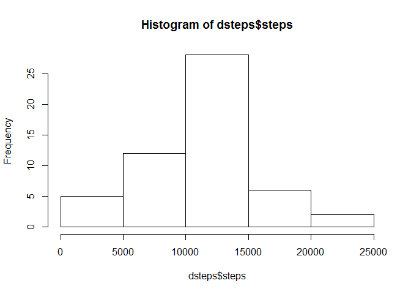
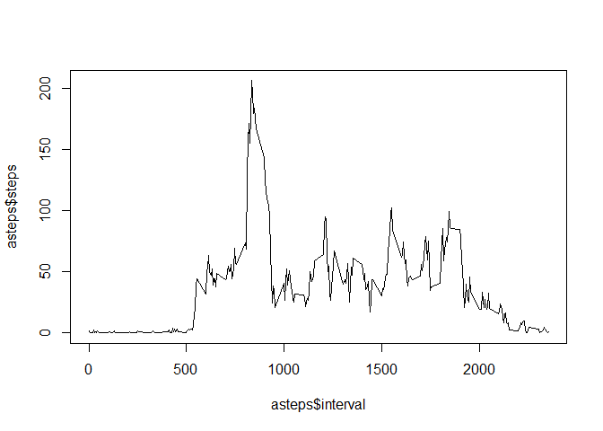
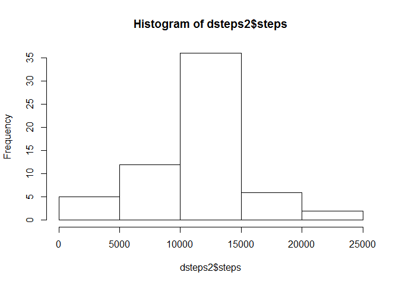
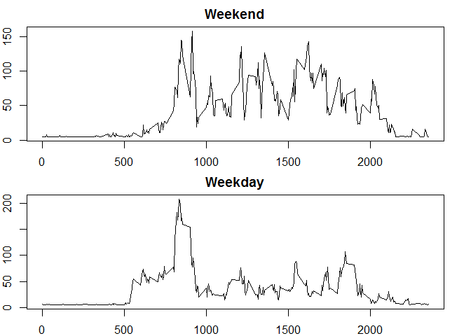

# Reproducible Research: Peer Assessment 1


## Loading and preprocessing the data
The first step that was taken was to load the data into R and save it in a vector called "activity":


```r
activity <- read.csv("activity.csv", stringsAsFactors = FALSE)
```
*note that I had to include the stringsAsFactors argument set to false to ensure the steps are numeric.*

## What is mean total number of steps taken per day?

Next I calculate the total number of steps taken per day and assign it to "dsteps":

```r
dsteps <- aggregate(steps ~ date, activity, sum)
```
And I generate a histogram of the step frequency like this:

```r
hist(dsteps$steps)
```

<!-- -->

I can then calculate the mean of the total number of steps taken per day:

```r
mean(dsteps$steps)
```

```
## [1] 10766.19
```
and the median of the total number of steps taken per day:

```r
median(dsteps$steps)
```

```
## [1] 10765
```
As we can see above, the mean is **10766.19** and the median is **10765**.

## What is the average daily activity pattern?
Next I calculate the average number of steps taken per interval across all days and assign it to "asteps":

```r
asteps <- aggregate(steps ~ interval, activity, mean)
```

Then I generate a time series plot of the five minute interval on the x-axis and the average number of steps taken across all days on the y-axis:

```r
plot(asteps$interval, asteps$steps, type = "l")
```

<!-- -->

*note: type is set equal to "l" so that the output is a line plot*

I calculate the 5-minute interval with the maximum average number of steps as follows:

```r
which.max(asteps$steps)
```

```
## [1] 104
```

The result is the **104th** interval.

## Imputing missing values
Next I calculate the total number of missing values in the dataset with

```r
sum(is.na(activity))
```

```
## [1] 2304
```

I want to fill in all of the missing values with the mean of total steps, which I can do by entering:

```r
for(i in 1:ncol(activity)){
        activity[is.na(activity[,i]), i] <- mean(activity[,i], na.rm = TRUE)
}
```

```
## Warning in mean.default(activity[, i], na.rm = TRUE): argument is not
## numeric or logical: returning NA
```

Then I generate another histogram of the step frequency in this new dataset like this:

```r
dsteps2 <- aggregate(steps ~ date, activity, sum)
hist(dsteps2$steps)
```

<!-- -->

And I calculate the mean of the total number of steps taken per day:

```r
mean(dsteps2$steps)
```

```
## [1] 10766.19
```
and the median of the total number of steps taken per day:

```r
median(dsteps2$steps)
```

```
## [1] 10766.19
```
The mean is the same, **10766.19** and the new median is now also **10766.19**
By imputing missing data the frequency total goes up and in the case the median becomes equal to the mean. 

## Are there differences in activity patterns between weekdays and weekends?
These last steps are taken to compare the number of steps on weekends with those on weekdays. A new column which classifies each date as a weekend or weekday is added as follows:

```r
wday <- c('Monday', 'Tuesday', 'Wednesday', 'Thursday', 'Friday')
activity$day <- as.Date(activity$date)
activity$day <- c('weekend', 'weekday')[(weekdays(as.POSIXct(activity$date)) %in% wday)+1L]
```

Then the data are separated into two sets by weekday and weekend:

```r
wdays <- activity[activity$day == "weekday", ]
wends <- activity[activity$day == "weekend", ]
```
Then I create two new dataframes with the average number of steps per interval for weekdays and weekends:

```r
wdaysteps <- aggregate(steps ~ interval, wdays, mean)
wendsteps <- aggregate(steps ~ interval, wends, mean)
```

And finally, a panel plot is created comparing the two datasets for steps on weekdays and weekends:

```r
par(mfrow=c(2,1))
par(mar=c(2,2,2,2))
plot(wendsteps$interval, wendsteps$steps, type = "l", xlab = "Interval", ylab = "Number of Steps", main = "Weekend")
plot(wdaysteps$interval, wdaysteps$steps, type = "l", xlab = "Interval", ylab = "Number of Steps", main = "Weekday")
```

<!-- -->

From these two plots we can see that the user was more active overall on weekends compared with weekdays.
